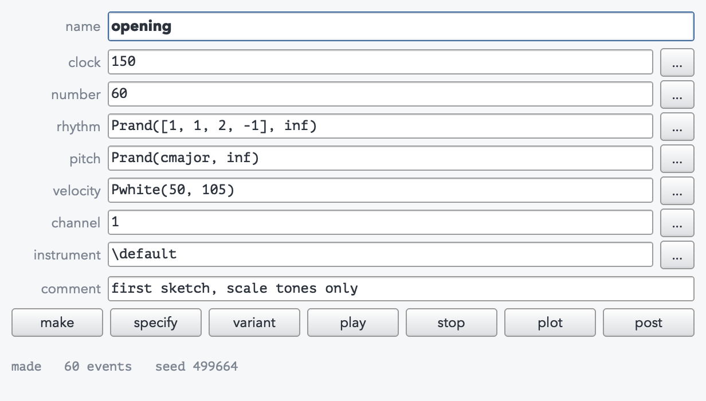
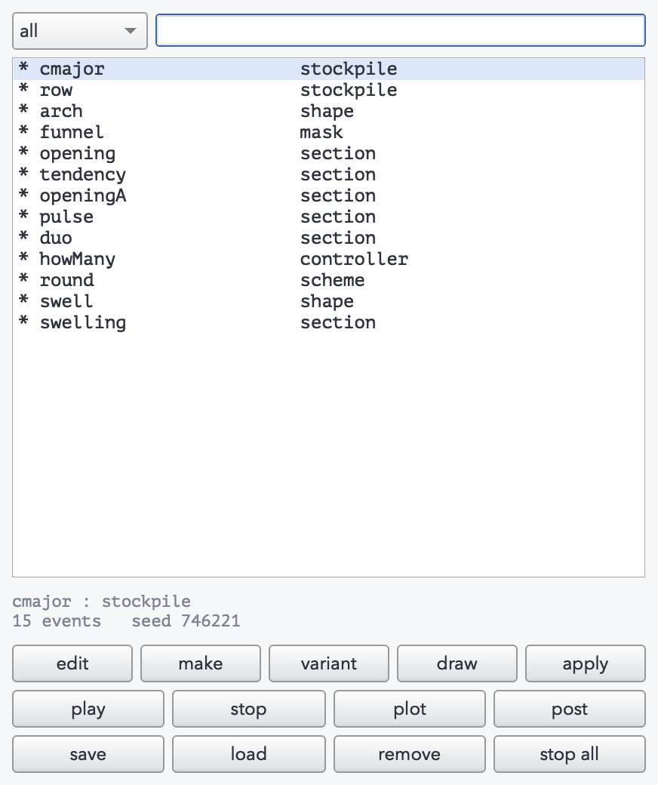
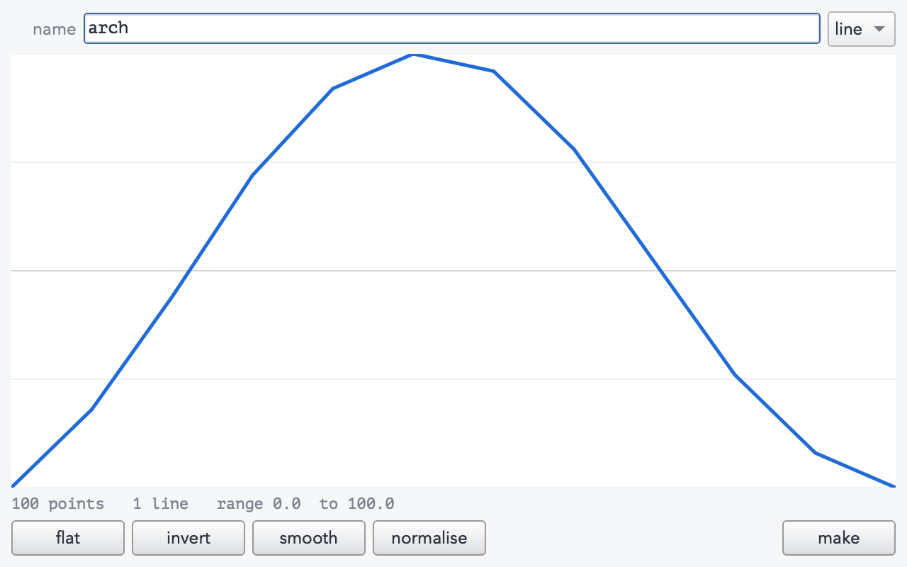
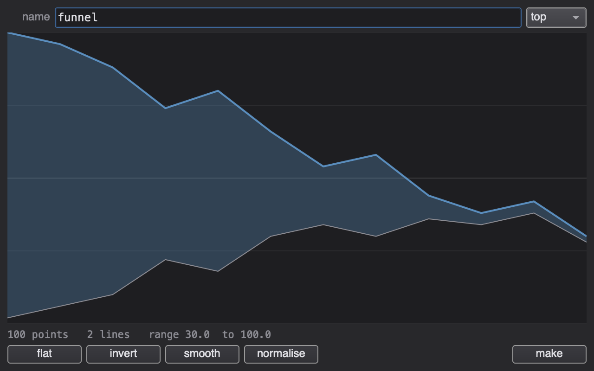
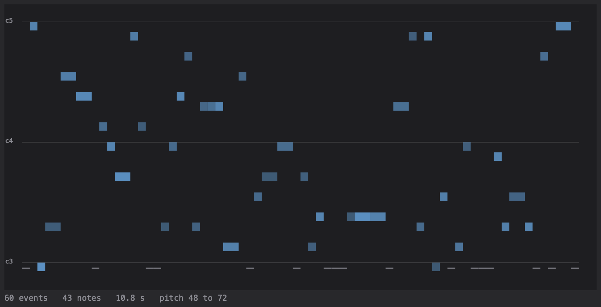
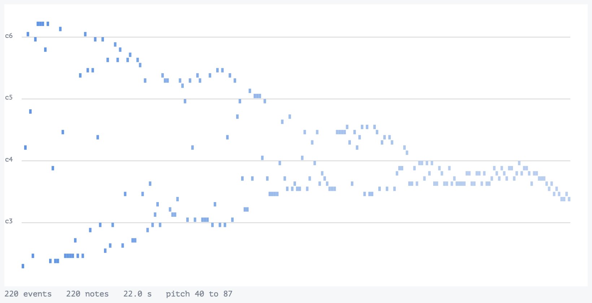
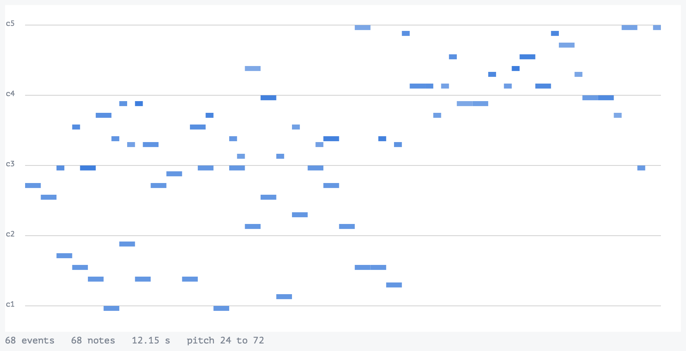
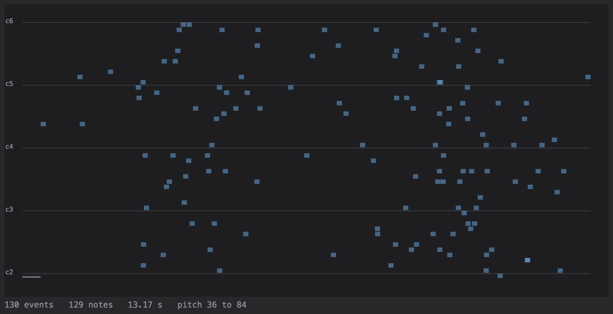

# Pattern Toolbox

Named, browsable, reproducible musical objects for SuperCollider.

A composition environment in the spirit of Paul Berg's **AC Toolbox**, built
over SuperCollider patterns. You make an object, it gets a name, you can look at
it, hear it, edit its rules, remake it, make a variant of it, and refer to it
from any other object. The rules and one specific result are both kept.

Status: **phase 6**. The object model, stockpiles, data sections, note structures,
note sections, density sections, shapes, masks, combinations, transformers,
filters, communities, controllers, schemes, a live `Pdef`-backed layer, MIDI file
and offline render export, source export, the archive format, the browser, the
object dialogs, the drawing editor and the piano roll all work and are covered by
tests. The extended generator library is next.



## Install

Clone into your Extensions folder and recompile:

```
~/Library/Application Support/SuperCollider/Extensions/Pattern-Toolbox
```

## Five minutes

```supercollider
// a named collection of values
PTStockpile.specify(\cmajor, "c4 d4 e4 f4 g4 a4 b4");

// a section: each parameter calculated independently
PTDataSection(\section1, (
	clock:    "150",                      // the beat, in milliseconds
	number:   "50",                       // how many notes
	rhythm:   "Prand([1, 2, 3], inf)",    // multiples of the beat
	pitch:    "Prand(cmajor, inf)",       // the stockpile, by name
	velocity: "\\mf"
)).make;

PT(\section1).play;
PT(\section1).plot;
PT(\section1).textScore;

// same rules, new result, new name
PT(\section1).variant(\section2).play;

// exactly the result you had before
PT(\section1).reproduce;

// save and reload the whole environment
PT.save("~/Desktop/sketch.ptx");
PT.load("~/Desktop/sketch.ptx");
```

## What you can write in a slot

Every slot is text, and every slot accepts the same kinds of thing.

| you write | you get |
| --- | --- |
| `60` | a constant |
| `c4` | a pitch name, middle C is `c4` |
| `cs4` `c#4` `ef4` `bf-1` | sharps, flats, negative octaves |
| `mf` `ff` `ppp` | dynamics as velocities |
| `1 2 3` or `c4 e4 g4` | a list, which cycles |
| `[[c4, e4, g4]]` | a chord (a flat array is a sequence, a nested one is a chord) |
| `Pwhite(60, 72)` | any SuperCollider pattern |
| `cmajor` | any object you have already made, by name |
| `PT.untilTime(10)` | in the number slot: fill ten seconds |
| `PT.bpm(160)` | in the clock slot |
| `-1` | in the rhythm slot: a rest of that length |

Bare names are rewritten before compiling: an object name becomes `~name`, a
pitch name becomes a note number, a dynamic becomes a velocity. Turn it off with
`PT.sugar = false` and write `~cmajor` and `60` yourself.

## Shapes and masks

A shape is one line, a mask is two. Neither carries a scale of its own: they are
contours, and they mean nothing until they are converted into a range.

```supercollider
PTShape.specify(\arch, "0 40 80 100 80 40 0");
PTMask.specify(\mask1, "100 90 70 100 60", "0 20 40 30 55");

PTShape.draw(\hand);    // drag left to right, then press make
PTMask.draw(\mask2);    // choose top or bottom, then drag

PT(\arch).convert(20, c3, c5);           // 20 note numbers following the contour
PT(\mask1).convert(20, 48, 72);          // 20 values inside the field
PT.readFrom(\cmajor, \arch, 20);         // the contour, limited to a stockpile
```

In a section, `PT.fromNumber` asks how many notes are being made, so a curve
stretches to fit instead of repeating:

```supercollider
PTDataSection(\s1, (
	number: "200",
	pitch:  "mask1.convert(PT.fromNumber, 48, 72)"
)).make.play;
```

By default the choice inside a mask is uniform. Hand it `PTbeta` with small shape
parameters and the values hug the two boundaries, so the mask is heard as two
lines rather than a filled band:

```supercollider
pitch: "mask1.convert(PT.fromNumber, 48, 72, PTbeta(0.0, 100, 0.1, 0.1))"
```

## Note structures: music you already know

A data section calculates rhythm and pitch apart from each other, which is
excellent for material and useless for melodies. A note structure treats a note
as one indivisible thing, and notes can be nested in sequence and in parallel.

```supercollider
PTNoteStructure(\theme, (
	source: "PT.melody(\"2 c4 1 d4 1 e4 2 g4 1 f4 1 e4 2 d4 1 r 2 c4\")"
)).make;

PTNoteSection(\played, (clock: "300", notes: "theme")).make.play;
```

Rhythm first, then pitch. `r` is a rest, `.` is a delay, `c4+e4+g4` is a chord.
For anything more involved, build the tree: `PT.note`, `PT.rest`, `PT.delay`,
`PT.seq`, `PT.par` (also spelled `PT.aNote`, `PT.inSequence` and so on).

Used bare, a structure is played as written. Used through a generator it is
flattened and becomes material to choose from, which is how a known tune turns
into raw material:

```supercollider
notes: "Pxrand(theme, inf)"                     // reordered
notes: "PT.readFrom(theme, arch, PT.fromNumber)" // read in the order of a shape
notes: "PT.interpolate(theme, other, 160)"       // one melody becoming another
```

## Density sections: filling time

The other way round: not "make this many notes" but "here is an amount of time,
fill it this thickly". Time is in seconds, note durations in milliseconds.

```supercollider
// attack points as a percentage of the total time
PTDensity(\even, (time: "10", attacks: "0 10 20 30 40 50 60 70 80 90")).make.play;

// a generator instead: the density curve of the section is the density curve of
// the generator, so this crowds both ends and thins out in the middle
PTDensity(\edges, (time: "10", number: "120",
	attacks: "PTbeta(0.0, 100, 0.2, 0.2)")).make.play;

// the Xenakis way: the function gives the distance to the next attack
PTDensity(\intervals, (time: "12", number: "80",
	attacks: "PT.attacks(PTbeta(0.0, 0.1, 1, 1))")).make.play;

// or give the density a shape, read as notes per second
PTDensityCurve(\swelling, (time: "14", curve: "swell",
	min: "1", max: "24", unit: "1")).make.play;
```

A mask instead of a shape makes the density a tendency: at each step the count is
chosen somewhere between the two lines.

## Combining sections

```supercollider
PTSequence(\pair, (sections: "bass lead")).make.play;      // one after another
PTSequence(\spaced, (sections: "bass 2 lead")).make;       // a 2 second gap
PTParallel(\duo, (sections: "bass lead")).make;            // at the same time
PTParallel(\stagger, (sections: "bass 0.4 lead")).make;    // the second enters late
PTTimed(\entries, (sections: "bass lead", times: "0 1.5")).make;
```

A combination is a section like any other, so they nest.

## Transforming sections

A transformed section is its own named object. Its rules say what was done, so it
can be remade, varied and saved like anything else, and the source is untouched.

```supercollider
PTDerived(\up, (source: "lead", transform: "PT.transpose(12)")).make.play;

PTDerived(\shaped, (
	source:    "lead",
	transform: "[PT.slice(8, 24), PT.stretch(2), PT.fold(c3, c5)]"
)).make.play;
```

Transforms apply left to right. Amounts can be constants, lists or generators, so
`PT.transpose(Pwhite(-5, 5))` moves every note by a different interval.

| values | `add` `multiply` `set` `transpose` `louder` `limit` `fold` `quantize` |
| --- | --- |
| time | `stretch` |
| structure | `filter` `reject` `mute` `dedupe` `reverse` `slice` `keep` `drop` |
| conditional | `transformIf` |

`filter` keeps what the test accepts and closes the gaps, so the section gets
shorter. `mute` silences instead, keeping the timing.

## Communities

A group of sections joined in name only, either listed or generated as variants
of one section.

```supercollider
PTCommunity(\voices, (members: "bass lead")).make;
PTCommunity(\family, (source: "lead", number: "5")).make;   // lead1 ... lead5

PT(\family).asSequence(\chain, 0.5).play;    // hear the variants in a row
PT(\family).asParallel(\cloud, 0.25).play;   // or all at once, staggered
```

## Controllers: relating one section to the next

A generator inside a section's rules knows nothing about the previous section, so
it cannot say anything about the relation between them. A controller keeps its
state outside any section and remembers what it has done.

```supercollider
PTController(\howMany, (source: "2 10 20")).make;
PTDataSection(\bit, (number: "howMany", pitch: "Pwhite(c3, c5)")).specify;

PT(\bit).make.length;   // 2
PT(\bit).make.length;   // 10
PT(\bit).make.length;   // 20
```

Used bare, a controller gives a value per note. `PT.takeOne` pulls one value and
holds it for the whole section, which is how a run of variants can trend:

```supercollider
PTController(\ceiling, (source: "Pseries(3.0, -0.375, 5)")).make;
PTDataSection(\gesture, (
	number: "24",
	rhythm: "PTbeta(1.0, PT.takeOne(ceiling), 0.2, 0.2)"
)).specify;

PTCommunity(\gestures, (source: "gesture", number: "5")).make;
// five variants, each tending faster than the last
```

Two controllers synchronised to a third see the same value, so two parameters can
be derived from one decision, note for note:

```supercollider
PTController(\choose, (source: "Prand([1, 2, 3, 10], inf)")).make;
PTController(\forRhythm, (syncTo: "choose")).make;
PTController(\forVelocity, (syncTo: "choose")).make;
PTStockpile(\table, (source: "1 40 2 55 3 70 10 110")).make;

PTDataSection(\linked, (
	rhythm:   "forRhythm",
	velocity: "PT.lookup(forVelocity, table)"
)).make;   // short notes quiet, long notes loud
```

`PT(\name).history` is everything a controller has handed out; `reset` starts it
again, and a given seed replays a given history exactly.

## Schemes

A script for remaking objects in a fixed order: convenience, because a section
that reads a generated shape needs the shape remade first, and design, because
the order is itself a decision.

```supercollider
PTScheme(\round, (members: "curve theme", reset: "ceiling")).make;
PT(\round).apply;
PT(\round).applyTimes(3);
```

## Playing live

Every other object keeps rules and one realization of them. A bind keeps only the
rules: it has no events at all, and plays through a `Pdef` named after itself, so
an edit lands on the next cycle rather than restarting.

```supercollider
PTBind(\live, (clock: "150", rhythm: "Prand([1, 1, 2, -1], inf)",
	pitch: "Prand(cmajor, inf)", velocity: "Pwhite(50, 110)")).make.play;

// change a slot, press make, and it changes underneath you
PT(\live).spec.put(\pitch, "Prand(cmajor, inf) + Prand([0, 12], inf)");
PT(\live).make;
```

Anything else a Pbind takes goes in the `extra` slot, as an Event:
`(pan: Pwhite(-0.8, 0.8), legato: 0.4)`.

A bind cannot be plotted or sliced, because there is nothing there yet. Capture it
and you get an ordinary section:

```supercollider
PT(\live).capture(\take1, 64);
PT(\take1).plot;
PT(\take1).make;         // a different 64 events of the same live material
PT(\take1).reproduce;    // the take you liked, exactly
```

## Getting out

```supercollider
PT(\sketch).asPbindSource.postln;   // the rules, as plain SuperCollider
PT(\sketch).asSource.postln;        // the events themselves, exactly
PT(\sketch).writeMidi("~/Desktop/sketch.mid");
PT(\sketch).render("~/Desktop/sketch.wav");   // offline, faster than real time
PT(\sketch).asScore;
```

Exported source stands on its own: pitch names become numbers and a referenced
stockpile is written out as its values, so `asPbindSource.interpret.play` works
with the toolbox uninstalled. Useful when the GUI has been doing the thinking and
you want to see what an object actually is.

MIDI out is there too, if you have a device: `PT.midiOut_(MIDIOut(0))` then
`PT(\sketch).playMidi`.

## The browser

```supercollider
PT.browse;          // the object list: filter, select, act
PT(\section1).edit; // one object's dialog
PT(\section1).plot; // piano roll
```

In the list: double click to open a dialog, drag a name into any field of any
other dialog, and the `*` marks objects that have been made. In a dialog: type
into the fields and press make, or change the name first and press make to get a
new object with the same rules. The `...` button opens a bigger editor with a
parenthesis check.

Playback goes through a `Pdef` named after the object, so you can edit and press
make while it is sounding and the next cycle picks it up.

## Screenshots

The object list, and the dialog for one section. Every slot is text; the `...`
button opens a bigger editor with a parenthesis check.

| | |
| --- | --- |
|  |  |

Drawing a shape and a mask. A mask is a field: choose top or bottom, then drag.
The selected line is drawn thicker, as in the original.

| | |
| --- | --- |
|  |  |

Piano rolls. On the left, notes and rests from a stockpile, brightness following
velocity. On the right, 220 notes read from the mask above at its boundaries with
`PTbeta`, so the tendency field is audible and visible as two converging lines.

| | |
| --- | --- |
|  |  |

A parallel combination. `\dur` is the time to the next event and `\sustain` is
how long a note sounds, which is what lets voices overlap.



A density section, where time comes first and a shape says how thickly to fill it.



Regenerate them all with `doc/make-screenshots.scd`, which uses
`Image.fromWindow`, so Qt renders each window itself and the result does not
depend on what else is on screen.

## Object lifecycle

| | |
| --- | --- |
| `make` | apply the rules, fresh result |
| `reproduce` | apply the rules with the stored seed, identical result |
| `specify` | store the rules without applying them |
| `variant(name)` | same rules, new name, new result |
| `remake` | apply again in place |

Every realization stores the random seed that produced it, so nothing you liked
is ever lost.

## Tests

```supercollider
TestPatternToolbox.run;
```

## Documentation

`doc/TUTORIAL.md` is the tutorial: sixteen short chapters in the style of Paul
Berg's original, from data sections through masks and controllers to playing live
and exporting. Every code block in it has been run.

`doc/tutorial.html` is the same thing as a single self-contained page, built from
the markdown with `python3 doc/build-tutorial.py`. Edit the markdown, never the
HTML.

`ARCHITECTURE.md` explains the design, what was taken from the AC Toolbox, what
was changed and why, and the phase plan.

## Credit

The AC Toolbox is by Paul Berg. This is an independent reimplementation of its
ideas in SuperCollider, not a port, and it carries no AC Toolbox code.
